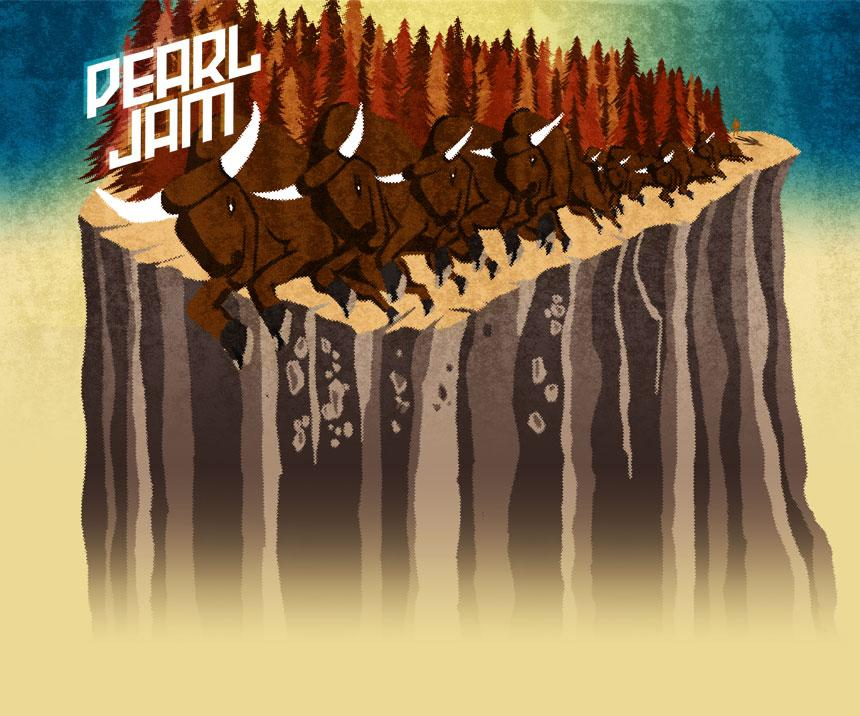

Title: 29 June 2007
Date: 2007/06/29 09:11

Ontem fui ver Pearl Jam a Nijmegen. Brilhante como sempre, talvez melhor que [Pearl Jam em Cascais](http://eyes.calepin.co/pearl-jam-em-cascais.html). Faltaram os [Aldónios](http://eyes.calepin.co/aldonios.html).

Cabrões dos holandeses não sabem curtir. Passam o concerto todo em pé, sem se mexerem. Parece que têm medo de se exprimir. Enfim, culturas diferentes. Só me faz lembrar [Smashing em Cascais](http://eyes.calepin.co/smashing-em-cascais.html) com os saudosos Smashing Pumpkins. Ou saltavas ou morrias. Senti-me sortudo por conseguir respirar por cima da multidão. Ainda levantei umas quantas pitas que caiam no meio da confusão.

Ah, foi também dia de tirar pedras do sapato.

##### 2007-06-28  Nijmegen   Holland  Goeffert Park
* Set 1: Release, Go, Hail Hail, World Wide Suicide, Whipping, Do The Evolution, Given To Fly, Not For You, Wishlist, Even Flow, Insignificance, Unemployable, Jeremy, Nothingman, Better Man/Save it for Later, Corduroy, Why Go
* Encore 1: Comatose, Daughter/Another Brick In The Wall/War, Leash, Rearviewmirror
* Encore 2: No More, Blood, Alive, Rockin' In The Free World, Yellow Ledbetter

