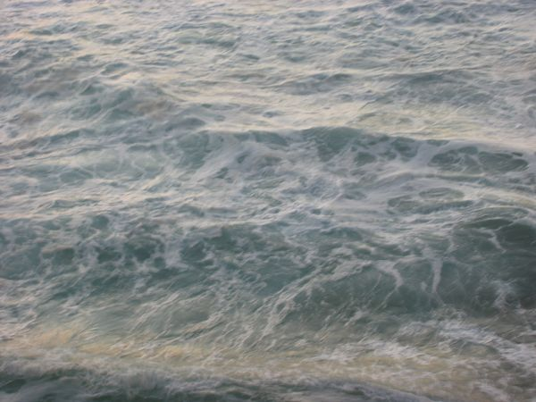

Title: 4 January 2008
Date: 2008/01/04 18:49

Vamos falar do ano passado. Foi lindo. Começou mal, deram-me um touro para eu agarrar-lhe os cornos, a meio mostrou-me do que eu sou capaz, acabou bem, mesmo muito bem.

Vamos falar deste ano. Está a ser lindo. Começou bem, mesmo muito bem. Daqui para a frente não sei. Olho e não vejo o que quero ver. O touro, esse cabrão. O touro está lá, já o agarrei e não o vou largar. Gosto dele, fez-me e faz-me acordar de manhã e gostar de o ter feito. Não posso evitar pensar como seriam as coisas se não houvesse touro. Mas há. E agora? Agora é como ontem: andar para a frente.

E aquelas muralhas... Vejo-me diante de escarpas íngremes batidas pelo mar, a olhar lá para cima à espera de ver qualquer coisa. Sei que o que lá está é lindo. Sei, pronto. Não consigo é lá chegar sozinho. Cerro os dentes em antecipação a cair-me tudo em cima. Não quero saber. Daqui não saio. E agora? Agora não sei.
