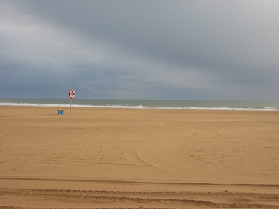

Title: A futilidade
Date: 2008/01/30 10:03

... de olhar por uma janela à espera de ver um carro que se sabe que não vem. 
... de pensar no 'se' quando esse nunca será. 
... de sentirmos o que sabemos não ter lugar para existir. 
... de tentarmos perceber motivações que nos são ortogonais. 
... de reconhecer futilidade nisto tudo e, mesmo assim, persistir em dar a importância sobre-humana que merece. Importância que temos certeza de nunca reconhecer completamente. Resta-nos o consolo do tempo e do esquecimento.

Guarda-me a vida na mão 
Guarda-me os olhos nos teus 
Dentro desta solidão 
Nem há presença de Deus

Como a queda dum sorriso 
Pelo canto triste da boca 
Neste vazio impreciso 
Só a loucura me toca

Esperei por ti todas as horas 
Frágil sombra olhando o cais 
Mas mais triste que as demoras 
É saber que não vens mais

Guarda-me a Vida na Mão, Ana Moura

