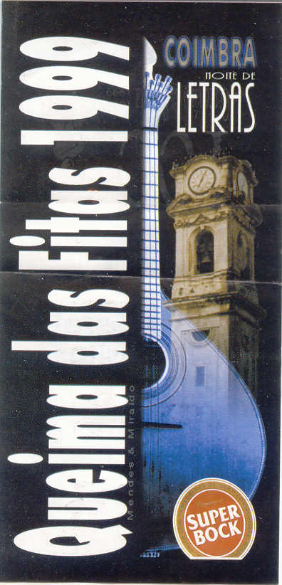

Title: Bora à Queima?
Date: 2008/02/17 17:40

... pergunta entusiasmado o Bébé, com aqueles olhos azuis esbugalhados e o seu incorrigível cabelo ruivo em turbilhão.
— Sou gajo para isso, diz o Bruxo.
&ndash; Vocês são loucos - diz o Balki, aka a Rata Jurássica - Já não deve de haver autocarros e depois vai lá estar bueda gente. Além disso não temos lugar para dormir.
&ndash; Não dormimos, conclui o Bruxo.
Entretanto entram uns quantos caloiros. Foram sumariamente convocados pelo Bébé e até acharam piada em sair á noite em Coimbra, assim em cima do joelho. Claro, o Balki também veio.

Fomos para o arco do cego, em plena romaria pelo metro a falar alto como se do mundo fôssemos donos. Naquele dia éramos.

&ndash; Queriamos 8 (já não sei quantos mas éramos bués) bilhetes para Coimbra no próximos autocarro! - Lá de trás ouve-se a inevitável ameaça: - Senão partimos esta merda toda!
&ndash; Olhe, o próximo autocarro sai às sete. Se estivessem chegado 10 minutos antes ainda apanhavam o das cinco.
&ndash; Oooh! Puta que o pariu! Foda-se para esta merda! Vou partir esta merda toda! - Diziam todos em frustação.
&ndash; Comé malta, vai-se ou não? Perguntei temendo a resposta.
&ndash; Claro, caralho! Antão! Foda-se, vim até aqui vou até Coimbra! Cala-te e compra a merda dos bilhetes! - Sorri com a determinação dos meus irmãos de armas.

&ndash; Oh e agora, pergunta o Bébé. Ainda faltam duas horas.
&ndash; Vamos alí a supermercado e compramos um six pack p'a cada um! - Respondi orgulhoso da minha ideia genial. Foi exactamente o necessário para levantar a moral das tropas e partimos de imediato à carga ao supermercado.

O tempo passou e as bejecas beberam-se. Enfim veio o autocarro. Lá fomos todos lá para dentro, meio entorpecidos pela cevada, contentes, cantando fazendo algazarra suficiente para merecermos os olhares reprovadores dos quotas que nos acompanhavam no autocarro.

Lembro-me perfeitamente. O autocarro sai do arco do cego, nem ainda tinha terminado de dar a volta ao quarteirão, vira-se o Bébé para trás com uma cara de terror.

&ndash; Quero mijar, caralhooooo!
&ndash; Foda-se! Também eu! - Diz o Bruxo com aquela cara de gozo mas consciente da alhada que estava metido.
&ndash; Quanto tempo é que demora a viagem? - Pergunta o Balki, visivelmente assustado.
&ndash; Estes putos... Pensei eu, apenas para me aperceber que estava no mesmo barco. - Tá fodido, respondi eu ao Bébé.

Claro, não aguentamos até Coimbra. Tivemos que convencer o motorista a parar, que só o fez depois de lhe explicarmos que éramos 8 e iamos mijar-lhe o autocarro todo. 'Andam na boémia e depois dá nisto', barafustou ele ciente da irreversibilidade da situação.
&ndash; Estes putos... Pensei eu, apenas para me aperceber que estava no mesmo barco. - Tá fodido, respondi eu ao

