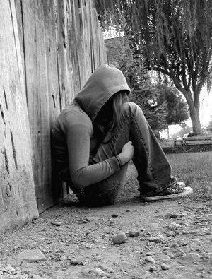

Title: Uma palavra era tudo
Date: 2008/03/03 15:12

Esta é sobre dor. Não é propriamente um assunto interessante, nem público, nem de expressão fácil.

Há um [gajo](http://en.wikipedia.org/wiki/Eddie_Vedder) (aliás, há [outro](http://en.wikipedia.org/wiki/Stone_Gossard) também) que até acerta no tom da coisa de uma forma genial. Não só, até é perturbante a maneira como ele acerta no tom de tantas coisas.

Um dia ele escreveu o [seguinte](http://en.wikipedia.org/wiki/Black_%28song%29):

Sheets of empty canvas, untouched sheets of clay 
Were laid spread out before me as her body once did. 
All five horizons revolved around her soul 
As the earth to the sun 
Now the air I tasted and breathed has taken a turn 

And all I taught her was everything 
I know she gave me all that she wore 
And now my bitter hands chafe beneath the clouds 
Of what was everything. 
The pictures have all been washed in black, tattooed everything... 

I take a walk outside 
I'm surrounded by some kids at play 
I can feel their laughter, so why do I sear? 
And twisted thoughts that spin round my head 
I'm spinning, oh, I'm spinning 
How quick the sun can drop away 

And now my bitter hands cradle broken glass 
Of what was everything? 
All the pictures have all been washed in black, tattooed everything... 

All the love gone bad turned my world to black 
Tattooed all I see, all that I am, all I'll be... 

I know someday you'll have a beautiful life, 
I know you'll be a sun in somebody else's sky, but why 
Why, why can't it be, why can't it be mine 

 

Aparentemente, isto não era suficiente então, em [cada actuação](http://forums.pearljam.com/showthread.php?t=255379) ele adicionava algumas linhas:

I don't... 
I don't think... 
...these people understand... 
...oh they don't understand.... 
...oh no one understands... 
...we belong together...together... 
...together 

You are the stars in the sky 
Thought you were up in mine 
Still I wonder 
I wonder 
I wonder 
You're so long gone 
We've all come alone 
Still I wonder 
Still I wonder 
With each breath I know you're there 
Somewhere 
I wonder 
I still wonder 

time heals the wounds 
no one can see 
time heals the wounds 
no one can see 
but my memories, my memories, won't let me be 
my memories 
won't let me be. 
we belong....we belong together....together... 
together...we belong....we belong together 
....together...together...together 
we belong... 

what could have been 
what could have been 
will never be 
it could have been here 
I could have been there 
well I want to be here 
fuck you and them 
I'm with my friends 
I've got an end 
what could have been 
what could have been 
no longer care 
I no longer care 
it's all right, it's all right 
it's all right, it's all right 

Há algo de contraditório nisto. Não é agradável, mas não é mau. Ensina-nos, lembra-nos, faz-nos crescer. Liga-nos ao que não podemos estar ligados. É o que nos resta do que deixou de existir. É uma construção própria de um impulso marcadamente externo. Não foi lá posta por nós, não nos é destinada mas é só nossa e origina em nós embora não a queramos.

Diminui mas não nos deixa. Aprendemos a viver com ela, torna-se primeiro um refúgio, depois um apoio, depois uma lembrança. Muda mas sabe sempre ao mesmo. A qualquer momento com o mínimo de determinação, podemos  buscar toda a sua fúria. Não é um peso que carreguemos, não é um saco de tijolos que temos que deixar para trás. É uma cicatriz, agarra-se a nós. Incomoda, coça-se, ganha-se o tique de andar lá com a mão a mexer. Depois, anos mais tarde, parece diferente porque nunca mais olhamos para ela.

Isto não é chafurdar na merda. É o que é. Por mais que se queira as coisas aconteceram. É aqui que analise acaba, não há mais para além disto.

É como o soldado veterano. Tem-nas, as cicatrizes, mas não fala delas. Aparecem todas quando se despe e quem as vê assusta-se. Só não se assusta quem também as têm. O problema é toda a gente as tem mas muita gente, melhor, demasiada gente assusta-se. Não sei porque recusar o que se é. Eu cá estou bem com as minhas.

Como dizia o outro:

_it's all right, it's all right_

