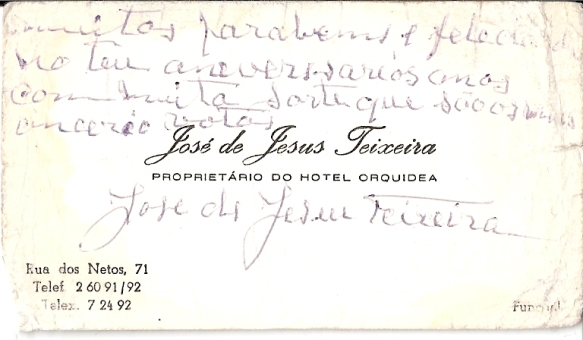

Title: 17 April 2008
Date: 2008/04/16 23:23

O meu avô morreu há 17 anos e 3 dias. Na noite interior estive com ele sozinho ao lado da cama. Pedi-lhe para lutar e para vencer a doença. Não sabia o que estava a pedir. Pensava, nos meus 14 anos, que aquele homem podia fazer tudo. Que era só fechar os olhos e uns dias depois estava tudo normal.

Já estou vivo há mais tempo sem ele do que com ele. Nem me apercebi disso até agora.
